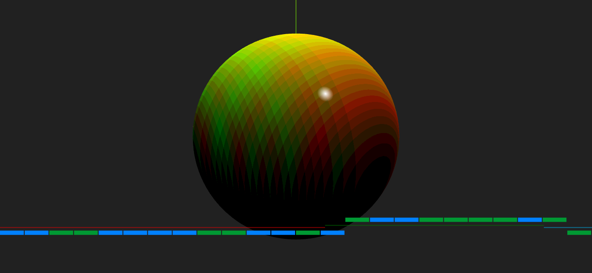
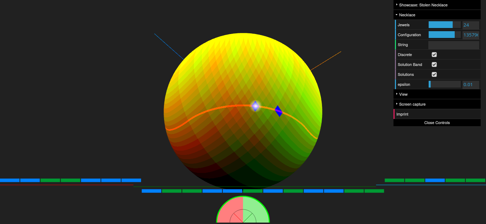
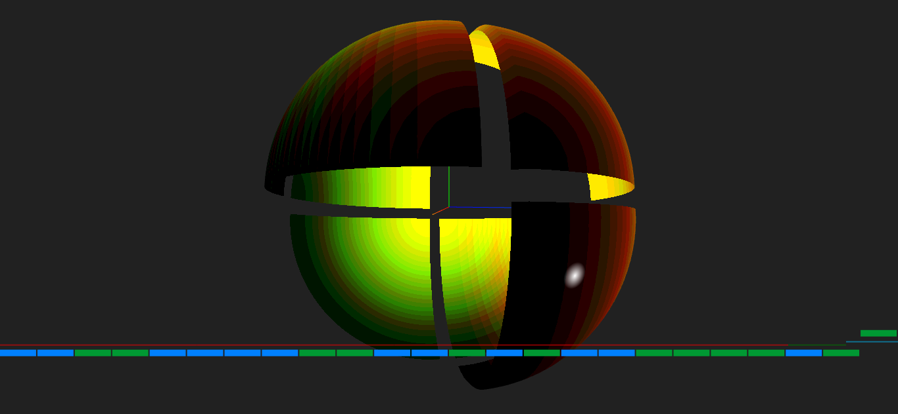

# necklace-splitting
This HTML-5 application features an explorable visualization of the [Necklace splitting problem](https://en.wikipedia.org/wiki/Necklace_splitting_problem) and its connection to the [Borsuk-Ulam theorem](https://en.wikipedia.org/wiki/Borsuk%E2%80%93Ulam_theorem). Online available, [here](https://mkuehne-git.github.io/necklace-splitting/).

After watching the [3blue1brown](https://www.youtube.com/channel/UCYO_jab_esuFRV4b17AJtAw) video [The Borsuk-Ulam theorem and stolen necklaces](https://youtu.be/yuVqxCSsE7c) a couple of times, I wondered, how the mapping of the necklace splitting onto a sphere would actually look like.

Each point (x,y,z) on the sphere denotes a necklace cut - note the white indicator on the image. The cut splits the necklace in maximal three segments of length (x²,y²,z²). The sign of each ordinate assigns the segment to either thief A or B.

The coloring indicates how much thief A owns per jewel type. The colors red and green are used to distinguish between the jewel types. Bright yellow (mix between red and green) for instance indicates that thief A owns the majority of both jewel types.

## Solve the Necklace splitting Problem
If both jewel types are equally split between the two thiefs, the length of the necklace segments assigned to each thief must be identical. The orange line around the sphere shows this solution band (enable with ***Necklace/Solution Band***). All solutions independent from the necklace configuration exist on this line only.

Given a first cut position, the second possible cut can be calculated directly. The solutions (enable with ***Necklace/Solutions***) for a given necklace configuration can be calculated in linear time by iterating through the jewels.



## Octants
The sphere can be divided into eight octants. The octants can be enumerated using the polarity of (x,y,z) as binary digit. The octants are symmetrical to the origin. Mirrowing an octant at the origin means swapping the thiefs. The octants with number 000 and 111 are not very interesting, since they assign all jewels to just one thief. The option ***Single Thief's Area*** makes it possible to show or hide these octants from the view.

In contrast, the octants with number 010 and 101 show most diversity. Whenever two cuts are necessary, you will find the solutions in these octants.

You can extrude the octants from the sphere using the slider ***Octant Offset***.



## Proof of Borsuk-Ulam theorem

Starting at [6:19](https://youtu.be/yuVqxCSsE7c?t=379) the video starts explaining why the [Borsuk–Ulam theorem](https://en.wikipedia.org/wiki/Borsuk%E2%80%93Ulam_theorem) is true.

Let f(x) be the continous function, that maps the surface of the sphere to the 2D plane, then all we need to do is looking for the zeroes of a function g(x) = f(x) - f(-x). Since x and -x are antipodal points on the sphere, it is sufficient to show, that g(x) must have at least one zero. The function g(x) is symmetrical to the origin. 

If you calculate g(x) for a circle line around the sphere in the xy plane, the image of g(x) forms a continous, closed loop surrounding the origin. This is because g(x) is both continous and symmetric to the origin. 

Now, if the circle line is moved along the z-axis towards one pole the closed loop around the origin created by g(x) degenerates into a single point. Since this transformation is continous, the loop must cross the origin at some point during that movement.

The option ***View/Sphere/Borsuk-Ulam*** visualizes the 3D shape, that results from the moving image of g(x). 

> **Note**: This is currently work in progress

The current implementation has some flaws, because the shape of g is created by simply shifting each point form the sphere's mesh (origin) to the image location g(x). This allows for a quick, first view, but it doesn't preserve the integrity of the mesh. That may lead to unexpected rendering artifacts.

# Getting started

## Online
View live on GitHub-Pages [https://mkuehne-git.github.io/necklace-splitting/](https://mkuehne-git.github.io/necklace-splitting/)

## Local Installation
* Download this repository to your local machine and run

    ```bash
    $ npm install
    $ npm ci
    $ npm run imprint
    $ npm run dev
    ```

    ```
    > stolen-necklace@0.2.2 expose
    > vite --host

    
      vite v3.2.3 dev server running at:

      > Local: http://localhost:5173/
      > Network: use `--host` to expose

      ready in 152ms.
    ```

* Open [localhost:5173](http://localhost:5173) to launch the application. The port may differ. If you want to expose it to other clients in your network, use

    ```bash
    $ npm run expose
    ```  
    instead.
   
## Build and Deploy

If you want to create your own build or deployment - please check out the [instructions](BUILD.md).

# Keyboard

|Key|Description|
|---|---|
|```h```, ```H```|Toggle visibility of control panel|
|```CTRL + #```|Take screen capture|
|```Esc```|Close imprint dialog|

# References

## Explain Necklace-Splitting

* [Sneaky Topology | The Borsuk-Ulam theorem and stolen necklaces](https://youtu.be/yuVqxCSsE7c) - Video
* [Necklace splitting problem](https://en.wikipedia.org/wiki/Necklace_splitting_problem) - Wikipedia
* [Borsuk–Ulam theorem](https://en.wikipedia.org/wiki/Borsuk%E2%80%93Ulam_theorem) - Wikipedia

## Implementation

* *Lewy Blue,* [Discover three.js](https://discoverthreejs.com/)
    * [WebGLProgram](https://threejs.org/docs/#api/en/renderers/webgl/WebGLProgram) Built-in uniforms and attributes
* *Patricio Gonzalez Vivo, Jen Lowe,* [The Book of Shaders](https://thebookofshaders.com/)

# Acknowledgments

* [Vite](https://github.com/vitejs/vite) - Next Generation Frontend Tooling
* [vite-plugin-glsl](https://www.npmjs.com/package/vite-plugin-glsl) - Recursively imports and inlines shader chunks within GLSL files relative to their directory.
* WebGL [three.js](https://threejs.org/)
* Settings with [lil-gui](https://github.com/georgealways/lil-gui)

# License

This project is licensed under the MIT License - see the [LICENSE](https://github.com/mkuehne-git/necklace-splitting/blob/main/LICENSE) file for details
