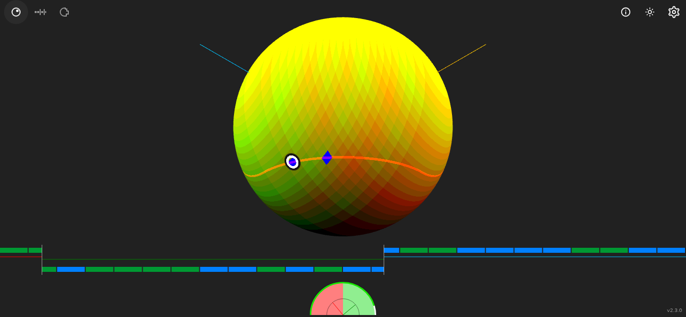
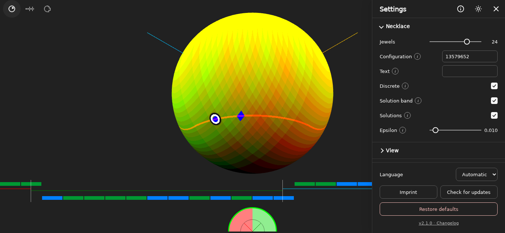
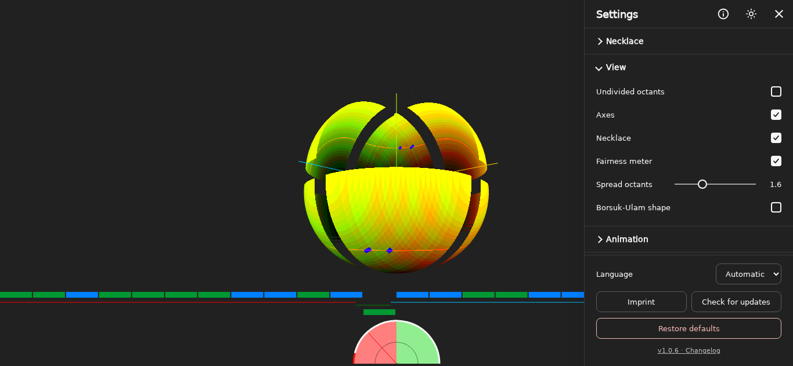
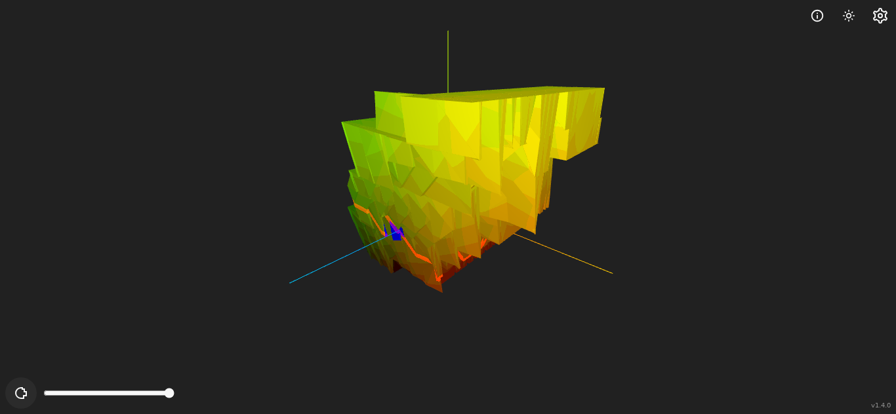
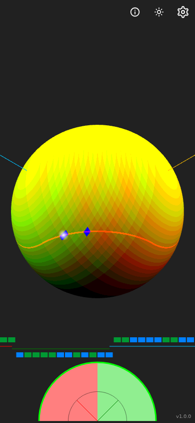
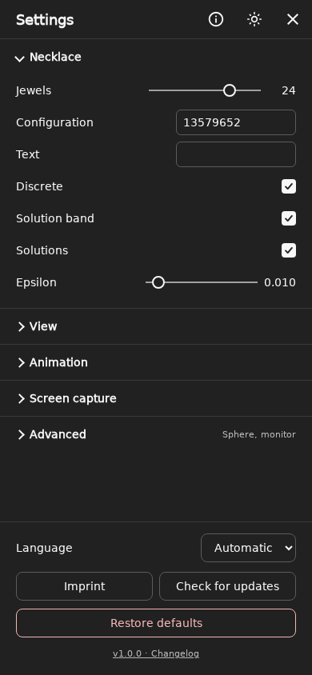
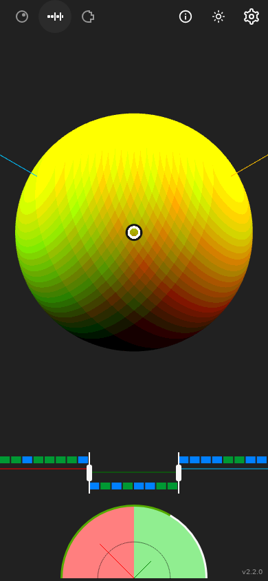

# Necklace Splitting

An explorable visualization of the [necklace splitting problem](https://en.wikipedia.org/wiki/Necklace_splitting_problem) and its connection to the [Borsuk-Ulam theorem](https://en.wikipedia.org/wiki/Borsuk%E2%80%93Ulam_theorem), in English and German.

**[Open the app](https://mkuehne-git.github.io/necklace-splitting/)** - it runs in the browser and can be installed as an app (PWA) on phones and computers.

After watching the [3Blue1Brown](https://www.youtube.com/@3blue1brown) video [The Borsuk-Ulam theorem and stolen necklaces](https://youtu.be/yuVqxCSsE7c) a couple of times, I wondered how the mapping of the necklace splitting onto a sphere would actually look.

## The sphere

Two thieves want to share a necklace with jewels of two kinds fairly, each getting half of each kind. The necklace has length 1, and each point $(x, y, z)$ on the unit sphere is a pair of cuts: they split the necklace into up to three pieces of the lengths $x^2$, $y^2$ and $z^2$, which add up to the whole necklace because

$$x^2 + y^2 + z^2 = 1.$$

The sign of each coordinate gives its piece to thief A ($+$) or thief B ($-$).

Point at the sphere: the marker, a white ring with a dark outline, shows the point, the necklace below it the cuts, and the fairness meter how fair the split is. One line per thief shows how much of each kind of jewel that thief gets; the dotted arc marks a fair share, and the outer arc turns from red to green as the split gets fairer.

The colors on the sphere show how much thief A gets of each kind: red for the first kind, green for the second. Bright yellow, a mix of both, means thief A gets most of both kinds.

## Solving the necklace splitting problem

A split can only be fair if both thieves get equally long pieces of the necklace, that is, if the pieces of thief A add up to half of it:

$$\sum_{c \in \lbrace x, y, z \rbrace,\ c > 0} c^2 = \frac{1}{2}.$$

The orange band around the sphere marks these points. Whatever the jewels, every solution lies on the band (*Necklace › Solution band*).

The fair splits of the current necklace are marked in blue (*Necklace › Solutions*; *Epsilon* sets how far from an exact solution a split still counts as fair). They can be found in linear time: place the first cut after each jewel in turn; the second cut then follows directly, since the piece between the cuts must be half the necklace. In the picture at the top, the pointer rests on one of the solutions: the fairness meter shows exactly half of each kind for each thief.



The necklace is set by a number, whose binary digits are the jewels (lowest digit first), or by a text, whose characters' binary digits are the jewels. *Discrete* counts whole jewels; without it, a cut can split a jewel.

## Octants

The signs of $(x, y, z)$ divide the sphere into eight octants, numbered by the signs as binary digits. Opposite octants swap the thieves. The octants 000 and 111 give everything to one thief: the necklace stays undivided. *View › Undivided octants* hides them.

The octants 010 and 101 show the most variety: whenever two cuts are needed, the solutions lie there. *View › Spread octants* pulls the octants away from the origin.



## Why a solution always exists

From [6:19](https://youtu.be/yuVqxCSsE7c?t=379) on, the video explains why the Borsuk-Ulam theorem is true. Let

$$f: S^2 \to \mathbb{R}^2$$

be a continuous map of the sphere to the plane - here, the shares of each kind of jewel that thief A gets. The opposite point $-\mathbf{x}$ makes the same cuts with the thieves swapped, so $f(-\mathbf{x})$ is what thief B gets. A split is fair exactly when $f(\mathbf{x}) = f(-\mathbf{x})$. We have to prove that there is at least one such point. In other words, the auxiliary function

$$g(\mathbf{x}) = f(\mathbf{x}) - f(-\mathbf{x})$$

must have at least one zero. Along a circle around the sphere, $g$ forms a closed loop around the origin, because $g$ is continuous and $g(-\mathbf{x}) = -g(\mathbf{x})$. Moving the circle towards a pole shrinks the loop continuously to a single point, so on the way the loop must cross the origin.

The Borsuk-Ulam button in the upper left corner morphs the sphere into the 3D shape formed by $g(\mathbf{x})$ as the circle moves: each point $\mathbf{x}$ of the sphere is drawn at $(g(\mathbf{x}), z)$, in the colors of the sphere. The slider beside the button moves the view anywhere between sphere and shape. Fair splits lie where the shape meets the $z$ axis (*View › Axes*). With *Necklace › Discrete*, $g$ jumps from value to value; the walls between the steps span these jumps. *View › Lighting* shades the shape, so that its facets and walls stand out even without the mesh.



## Using the app

  

- **Point or cut**: the two buttons in the upper left corner choose what sets the cuts. *Point at the sphere* is the view above. *Cut the necklace* turns it around: drag the two handles along the necklace and tap a piece to give it to the other thief. The marker on the sphere follows, the view turns to it when it nears the rim or goes out of sight, and a fair split is celebrated.
- **Borsuk-Ulam shape**: the button beside them morphs the sphere into the shape of $g$ (see above).
- **Settings** (gear button, or `h`): the necklace, what the view shows, a rotation animation and screen captures; *Advanced* holds the sphere's mesh and colors. The app remembers them; *Restore defaults* goes back to the original ones.
- **About this app** (info button): the explanation above, in the app.
- **Language**: the app follows the browser's language (English or German); *Language* at the bottom of the settings chooses one.
- **Changelog**: the version number in the lower right corner shows what changed; after an update, the app shows once what is new.
- The light and dark theme button follows the system until you choose one.

### Keyboard

| Key | Action |
| --- | --- |
| `h` | Open or close the settings |
| `Alt` + `S` | Save a screen capture (what *Screen capture* in the settings chooses) |
| `Esc` | Close the imprint, the changelog or the explanation; otherwise the settings |
| `Tab`, `Enter`, `Space` | Reach and use every button and control |
| `←`, `→` | Move the focused handle of the necklace by one jewel (*Cut the necklace*) |

# Getting started

## Local installation

Install [Node.js](https://nodejs.org/) 24 (`nvm use` picks it from `.nvmrc`), download this repository and run

```bash
npm ci
npm run imprint
npm run dev
```

`npm run imprint` creates `src/imprint-gen.js`, which the build needs; without an `imprint.config.json` the app simply shows no imprint.

Open [https://localhost:5173](https://localhost:5173); the port may differ. The development server is also reachable from other devices in your network, for example a phone, at the network address it prints. It uses a self-signed certificate, so the browser asks you to accept it first. If that does not work, use `npm run dev:http` and open [http://127.0.0.1:5173](http://127.0.0.1:5173) instead (over plain HTTP, only `localhost` has the offline and update features).

## Development

```bash
npm run typecheck   # TypeScript types (the build does not check them)
npm test            # unit and component tests (Vitest)
npm run test:e2e    # end-to-end tests in Chromium and Firefox (Playwright); run `npm run build` afterwards
npm run screenshots # retake the README screenshots in docs/images/
```

`CLAUDE.md` describes the source layout and conventions, `TESTING.md` the tests, `ROADMAP.md` what is planned. Every change to `main` is checked by GitHub Actions (types, unit tests, build, end-to-end tests); Dependabot keeps the dependencies current.

## Build and deploy

```bash
npm ci
npm run imprint
npm run build
```

`deploy.sh` builds the app and force-pushes `dist/` to the `gh-pages` branch, from where GitHub Pages serves it. To deploy your own fork, change the repository in its `git push` line and the base path (`/necklace-splitting/`) in `vite.config.ts` to your repository's name.

# References

## Explaining necklace splitting

- [Sneaky Topology | The Borsuk-Ulam theorem and stolen necklaces](https://youtu.be/yuVqxCSsE7c) - video by 3Blue1Brown
- [Necklace splitting problem](https://en.wikipedia.org/wiki/Necklace_splitting_problem) - Wikipedia
- [Borsuk–Ulam theorem](https://en.wikipedia.org/wiki/Borsuk%E2%80%93Ulam_theorem) - Wikipedia

## Implementation

- *Lewy Blue,* [Discover three.js](https://discoverthreejs.com/)
    - [WebGLProgram](https://threejs.org/docs/#api/en/renderers/webgl/WebGLProgram) - built-in uniforms and attributes
- *Patricio Gonzalez Vivo, Jen Lowe,* [The Book of Shaders](https://thebookofshaders.com/)

# Acknowledgments

- [three.js](https://threejs.org/) - WebGL
- [Vite](https://vite.dev/) - frontend tooling
- [vite-plugin-glsl](https://www.npmjs.com/package/vite-plugin-glsl) - imports and inlines shader chunks within GLSL files
- [vite-plugin-pwa](https://vite-pwa-org.netlify.app/) - turns the app into a PWA, see `vite.config.ts`
- [@vitejs/plugin-basic-ssl](https://www.npmjs.com/package/@vitejs/plugin-basic-ssl) - a self-signed certificate for the development server
- [html2canvas](https://html2canvas.hertzen.com/) - screen captures and the imprint
- [Vitest](https://vitest.dev/), [happy-dom](https://github.com/capricorn86/happy-dom) and [Playwright](https://playwright.dev/) - tests
- [DejaVu Sans](https://dejavu-fonts.github.io/) via [Fontsource](https://fontsource.org/)
- [FavIcon Generator](https://realfavicongenerator.net/) - the favicons and the related section in `index.html`; the PWA icons were generated with PWABuilder Studio in VS Code.
- The settings panel, overlays, changelog and update handling were ported from [Climate Helix](https://github.com/mkuehne-git/climate-helix), which grew out of this project.

# License

This project is licensed under the MIT License - see the [LICENSE](https://github.com/mkuehne-git/necklace-splitting/blob/main/LICENSE) file for details.
