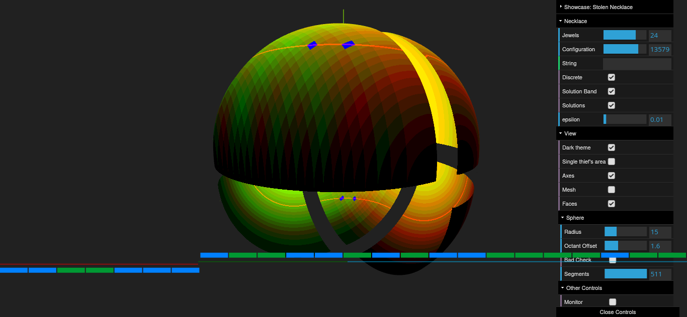
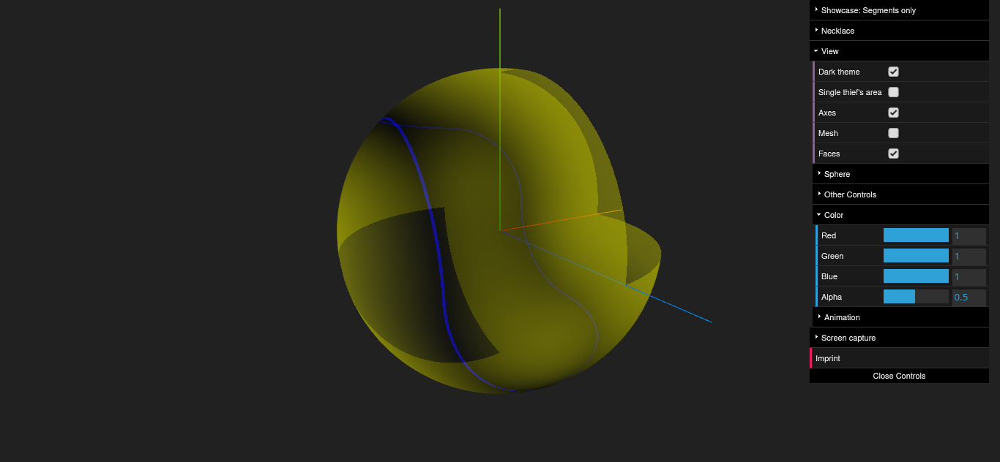

# necklace-splitting
This browser based application features an explorable visualization of the [Necklace splitting problem](https://en.wikipedia.org/wiki/Necklace_splitting_problem) and its connection to the [Borsuk-Ulam theorem](https://en.wikipedia.org/wiki/Borsuk%E2%80%93Ulam_theorem).

After watching the [3blue1brown](https://www.youtube.com/channel/UCYO_jab_esuFRV4b17AJtAw) video [The Borsuk-Ulam theorem and stolen necklaces](https://youtu.be/yuVqxCSsE7c) a couple of times, I wondered, how the mapping of the necklace splitting onto a sphere would actually look like.

This is a standalone HTML-5/Javascript application that runs in the browser.

Each point (x,y,z) on the sphere denotes a necklace cut - see the white indicator, which splits the necklace in maximal three segments of length (x²,y²,z²). The sign of each ordinate assigns the segment to either thief A or B.

The coloring indicates how much one thief owns per jewel type. The colors red and green are used to distinguish between the jewel types. Bright yellow (mix between red and green) for instance indicates that one thief owns the majority of both jewel types.

## Solving the Necklace-Splitting
If both jewel types are equally split between the two thiefs, each thief owns 0.5 per jewel type. The following image shows the distance to this target vector. The dark areas mark the target area. The blue spots in the lower right region of the sphere mark the best fit.


## Observing antipodal Points on Sphere
In addition to the necklace-splitting sphere a few other show cases are provided. All of them color the sphere continously with two or three colors. To better recognize the antipodal points on the sphere it is sometimes useful to remove one color.

## Special cases
### All Jewels assigned to one Thief
The sphere can be divided into eight octants. Two of them assign all jewels to only one of the two thiefs. The following image shows the sphere, where those less interesting octants have been removed.

### Only one Jewel available
In the case where the necklace contains only a single jewel, a fair split is only possible if continous splits are allowed. A fair split requires the line segments (x², y², z²) being equally distributed between the thiefs.


The blue band indicates these areas.

A similar scenario exists if the number of jewels is increased to infinity and the jewel types are randomly distributed (noise).

# Getting started

## Online
View live on GitHub-Pages [https://mkuehne-git.github.io/temp/](https://mkuehne-git.github.io/temp/)

## Local Installation
* Download this repository to your local machine and run

    ```bash
    $ npm install
    $ npm ci
    $ npm run dev
    ```

    ```
    > stolen-necklace@0.1.0 expose
    > vite --host

    
      vite v2.6.13 dev server running at:

      > Local: http://localhost:3000/
      > Network: use `--host` to expose

      ready in 152ms.
    ```

* Open [localhost:3000](http://localhost:3000) to launch the application. The port may differ. If you want to expose it to other clients in your network, use

    ```bash
    $ npm run expose
    ```  
    instead.
   
## Build and Deploy

If you want to create your own build or deployment - please check out the [instructions](BUILD.md).

# Keyboard

|Key|Description|
|---|---|
|```h```, ```H```|Toggle visibility of control panel|
|```s```|Take screen capture|
|```Esc```|Close imprint dialog|

# References

## Explain Necklace-Splitting

* [Sneaky Topology | The Borsuk-Ulam theorem and stolen necklaces](https://youtu.be/yuVqxCSsE7c) - Video
* [Necklace splitting problem](https://en.wikipedia.org/wiki/Necklace_splitting_problem) - Wikipedia
* [Borsuk–Ulam theorem](https://en.wikipedia.org/wiki/Borsuk%E2%80%93Ulam_theorem) - Wikipedia

## Implementation

* *Lewy Blue,* [Discover three.js](https://discoverthreejs.com/)
    * [WebGLProgram](https://threejs.org/docs/#api/en/renderers/webgl/WebGLProgram) Built-in uniforms and attributes
* *Patricio Gonzalez Vivo, Jen Lowe,* [The Book of Shaders](https://thebookofshaders.com/)

# Acknowledgments

* [Vite](https://github.com/vitejs/vite) - Next Generation Frontend Tooling
* [vite-plugin-glsl](https://www.npmjs.com/package/vite-plugin-glsl) - Recursively imports and inlines shader chunks within GLSL files relative to their directory.
* [rollup-plugin-dynamic-import-variables](https://www.npmjs.com/package/rollup-plugin-dynamic-import-variables)
* WebGL [three.js](https://threejs.org/)
* Settings with [dat.gui](https://github.com/dataarts/dat.gui)

# License

This project is licensed under the MIT License - see the [LICENSE](https://github.com/mkuehne-git/necklace-splitting/blob/main/LICENSE) file for details
